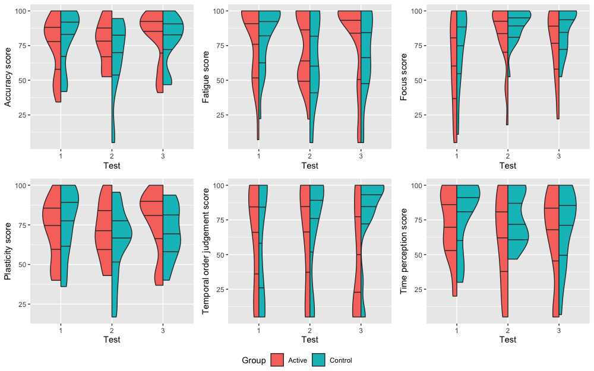

# KavaCorticalmetrics

The code and produced plots for the paper [The impact of traditional kava (Piper methysticum) use on cognition: Implications for driver fitness](https://www.sciencedirect.com/science/article/abs/pii/S0378874122001143).

The experiment data is not included for privacy reasons.

The most interesting findings are in the temporal order judgement data.

A quick snapshot is provided below.

or

